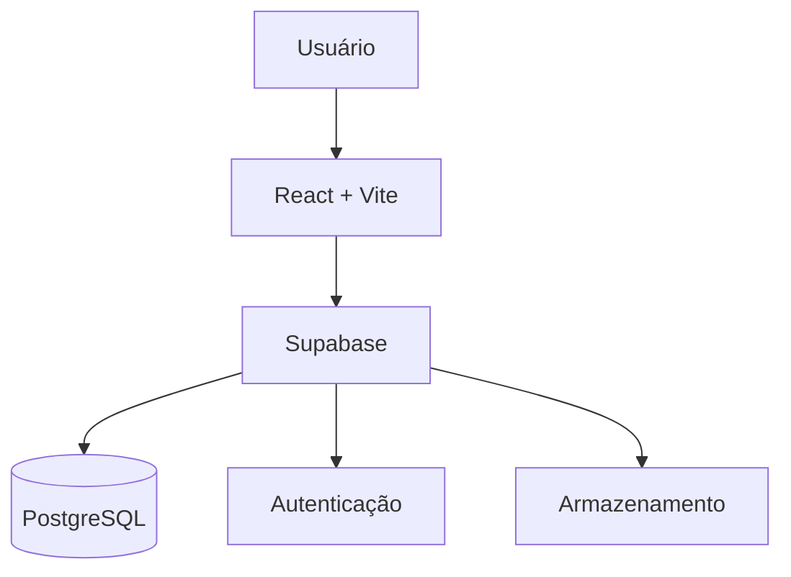

# 🚀 LegalFlux Smart Portal

[](LICENSE)
[](https://nodejs.org/)
[](https://supabase.io/)

 
*Painel de controlo completo para gestão jurídica*

## 📌 Índice

- [Visão Geral](#-visão-geral)
- [Destaques](#✨-destaques)
- [Capturas de Tela](#📸-capturas-de-tela)
- [Público-Alvo](#🎯-público-alvo)
- [Planos](#📦-planos)
- [Tecnologias](#⚙️-tecnologias)
- [Instalação](#🚀-instalação)
- [Contato](#📬-contato)

## 🌐 Visão Geral

LegalFlux é uma plataforma inteligente para advogados e escritórios de advocacia que otimiza processos, centraliza informações e potencializa resultados.

**Principais benefícios:**
- Gestão centralizada de casos jurídicos
- Portal dedicado ao cliente
- Agenda integrada com notificações automáticas
- Geração automática de documentos legais
- Módulo de insolvência para administradores especializados

## ✨ Destaques

### 📋 Painel de Controlo Inteligente
- Visão geral de processos ativos (28+ casos simultâneos)
- Alertas sobre prazos críticos
- Estatísticas e relatórios de produtividade

### 📅 Gestão de Prazos

*Visualização mobile dos prazos processuais*

- Controle dos próximos prazos e eventos
- Notificações automáticas por e-mail
- Integração com Google Calendar, Zoom e outros

### 📑 Módulo de Insolvência
- Geração automática dos principais documentos CIRE (Art. 129º, 154º)
- Gestão avançada de credores, inventário e checklist por fase

## 📸 Capturas de Tela

| Dashboard Principal | Visão Mobile |
|---------------------|--------------|
|  |  |

**Funcionalidades destacadas:**
- Listagem de processos ativos
- Próximos prazos (2 dias à frente)
- Documentos recentes
- Agenda de audiências

## 🎯 Público-Alvo

- **Juristas Independentes e Advogados Autônomos**
  - Gestão de múltiplos casos de forma individual
  - Visão financeira integrada

- **Escritórios de Advocacia de Pequeno/Médio Porte**
  - Até 3 assistentes incluídos (plano Profissional)
  - Fluxo colaborativo no dashboard

- **Administradores de Insolvência**
  - Módulo especializado (Add-on Enterprise)
  - Geração automatizada de relatórios legais

## 📦 Planos

| Recurso               | Basic   | Profissional | Enterprise |
|-----------------------|---------|-------------|------------|
| Processos ilimitados  | ✅      | ✅          | ✅         |
| Armazenamento         | 100MB   | 2GB         | 10GB+      |
| Assistente jurídico   | ❌      | 3           | Ilimitado  |
| Dashboard financeiro  | ❌      | Básico      | Completo   |
| Suporte prioritário   | ❌      | ❌          | ✅         |

## ⚙️ Tecnologias

**Stack Principal:**
- **Frontend:** React, Vite, TailwindCSS, ShadcnUI
- **Backend:** Supabase (PostgreSQL, Auth, Storage, Edge Functions)
- **Autenticação:** Magic Links Supabase
- **Hospedagem:** Vercel Edge



## 🚀 Instalação e Execução Local

Pré-requisitos: [Node.js >= 18](https://nodejs.org/), [Yarn ou npm], [Supabase CLI] (para edge functions, opcional).

```bash
# Instale as dependências
npm install

# Rode a aplicação em dev
npm run dev
```

Opcional: para edge functions e integração local, consulte [documentação Supabase](https://supabase.com/docs/guides/functions).

## 📬 Contato

- [Site Oficial LegalFlux](https://legalflux.com)
- Dúvidas ou sugestões: [suporte@legalflux.com](mailto:suporte@legalflux.com)

---

*LegalFlux — Plataforma moderna, segura e escalável para gestão jurídica.*
